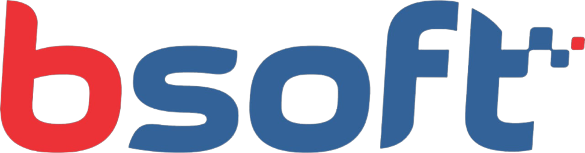

# BSoft - Employee Vacation Management System

A PHP-based web application for managing employee vacation requests, developed for BSoft company.



## 📋 About the Project

BSoft is a comprehensive employee vacation management system that allows:
- Employees to request vacation periods
- Administrators to approve/reject requests
- Calendar visualization of vacations by department
- Management of employees and departments

## ✨ Features

### For Employees:
- **Secure authentication** with email and password
- **Vacation requests** through interactive calendar
- **Personal profile** with options to change name and password
- **Information viewing** about vacation policies
- **Intuitive dashboard** with quick access to functionalities

### For Administrators:
- **Complete management** of employees and departments
- **Approval/rejection** of vacation requests
- **Listing and editing** of employee data
- **Department control** of the company
- **Overview** of all pending requests

## 🛠️ Technologies Used

- **Backend:** PHP 7+
- **Database:** MySQL
- **Frontend:** HTML5, CSS3, JavaScript
- **Libraries:**
  - jQuery 3.3.1
  - FullCalendar 3.9.0
  - Bootstrap 4.0.0
  - Moment.js 2.20.1
- **Architecture:** MVC (Model-View-Controller)

## 📁 Project Structure

```
BSoft/
├── controller/           # Controllers (business logic)
│   ├── c_conexao.php    # Database connection
│   ├── c_funcionario.php # Employee management
│   ├── c_setor.php      # Department management
│   ├── c_solicitacao_*.php # Request management
│   └── ...
├── model/               # Models (data access)
│   ├── m_funcionario.php
│   ├── m_setor.php
│   ├── m_solicitacao.php
│   └── database/
├── view/                # Views (user interface)
│   ├── admin/           # Administrator pages
│   ├── user/            # Employee pages
│   └── index.php        # Login page
```

## ⚙️ Installation and Setup

### Prerequisites
- PHP 7.0 or higher
- MySQL 5.7 or higher
- Web server (Apache/Nginx)

### Installation steps:

1. **Clone the repository**
   ```bash
   git clone [repository-url]
   cd bsoft
   ```

2. **Configure the database**
   - Create a MySQL database named `db_projeto`
   - Execute the SQL script located at `model/database/db_projeto.sql`

3. **Configure the connection**
   - Edit the file `controller/c_conexao.php`
   - Adjust the database credentials:
   ```php
   $databaseHost = 'localhost';
   $databaseName = 'db_projeto';
   $databaseUsername = 'root';
   $databasePassword = '';
   ```

4. **Configure the web server**
   - Point the document root to the project folder
   - Make sure PHP is enabled

5. **Access the system**
   - Open your browser and go to `http://localhost/bsoft`
   - Create the first account through the registration page

## 🚀 How to Use

### First Access
1. Access the home page
2. Click "Register" to create the first administrator user
3. Fill in all required data
4. After registration, login with your credentials

### For Employees
1. **Login:** Use registered email and password
2. **Request vacation:** Access "Request" and select dates on the calendar
3. **Profile:** View and edit personal information
4. **Information:** Check company vacation policies

### For Administrators
1. **Requests:** View and approve/reject pending requests
2. **Employees:** Register, edit, or remove employees
3. **Departments:** Manage company departments

## 📊 Business Rules

- Employees can request vacation only after 1 year of work
- Maximum of 3 employees per department can be on vacation simultaneously
- Vacation period: between 15 and 30 days
- Passwords must have minimum 5 characters with letter, number, and special character

## 🔐 Security

- Passwords encrypted with MD5
- Session validation on all protected pages
- SQL Injection protection
- Access control based on levels (user/administrator)

## 👥 Development Team

This project was developed as an academic work by students from the ADS 2023 course.

## 📄 License

This project was developed for educational purposes and is available under academic license.

## 🐛 Known Issues

- System uses MD5 for password hashing (recommend migrating to bcrypt)
- Some JavaScript validations could be reinforced on the backend

## 🤝 Contributing

To contribute to the project:
1. Fork the repository
2. Create a branch for your feature (`git checkout -b feature/new-feature`)
3. Commit your changes (`git commit -am 'Add new feature'`)
4. Push to the branch (`git push origin feature/new-feature`)
5. Open a Pull Request

## 📞 Support

For questions or support, contact the development team.

---

**BSoft Employee Vacation Management System** - Developed with ❤️ by ADS 2023 team
